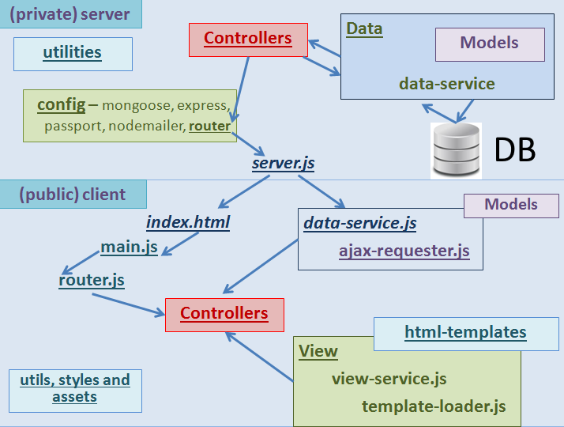

# Telerik Academy - "JavaScript Applications" Course Project

# **Games&Code** - JS RESTful SPA

**Games&Code** is a [JavaScript](https://www.javascript.com/ "JavaScript") single-page application with [Navigo](https://github.com/krasimir/navigo "Navigo"), [jQuery](http://jquery.com/"jQuery"), [Handlebars](http://handlebarsjs.com/ "Handlebars") and [SystemJS](https://github.com/systemjs/systemjs "SystemJS").
App works with [NodeJS](https://nodejs.org/ "NodeJS") as a server and [MongoDB](https://www.mongodb.com/ "MongoDB") as a database.

Inside the database there are three collections: Users, Blogs and Games.

**User**s collection contains objects like this:

```javascript
{
    "name": "",
    "email": "",
    "hashedPassword": "",
    "key": "",
    "image": "",
    "age": "",
    "blogs": [
        {
            "title": "",
            "date": "",
            "commentsNumber": "0",
            "likes": "0"
        }
    ],
    "games": [
        {
            "title": "",
            "date": "",
            "likes": "0"
        }
    ]
}
```

**Blog**s collection contains objects like this:

```javascript
{
    "role": "blog",
    "title": "",
    "image": "",
    "description": [
        {
            "tag": "strong",
            "content": "."
        },
        {
            "tag": "p",
            "content": ""
        },
        {
            "tag": "img",
            "content": ""
        }
    ],
    "tags": [
        "game-development",
        "canvas",
        "javascript",
        "tutoral"
    ],
    "comments": [
        {
            "author": "JohnDoe",
            "content": "Once upon a time a veeery interesting comment.",
            "date": ""
        },
        {
            "author": "JohnDoe",
            "content": "Once upon a time a veeery interesting comment.",
            "date": ""
        }
    ],
    "link": "",
    "author": "",
    "date": "",
		"likes": "0"
}
```

**Game**s collection contains objects like this:
```javascript
{
    "role": "game",
    "title": "Tetris",
    "image": "",
    "description": [
        {
            "tag": "p",
            "content": ""
        },
        {
            "tag": "img",
            "content": ""
        },
        {
            "tag": "strong",
            "content": ""
        }
    ],
    "tags": [
        "speeding-game",
        "strategic"
    ],
    "link": "",
    "likes": "0"
}
```

## Resources:

- to install node modules: >>npm install
- to run app: >>npm start

App is tested with [Mocha](https://mochajs.org/ "Mocha"), [Chai](http://chaijs.com/ "Chai") and [SinonJS](http://sinonjs.org/ "SinonJS").

- to run tests: >>npm test

Design is supported by [Twitter Bootstrap](http://getbootstrap.com/ "Twitter Bootstrap"), [jQuery-UI](http://jqueryui.com/ "jQuery-UI") and [Sass](http://sass-lang.com/ "Sass").

- to run sass watcher: >>npm run sass


## MVC architecture block-scheme: 


## Server routes:

### Users

* `api/users`
  * GET
    * **Returns** all users
  * POST
    * **Registers** a new user
    * Needs **email**, **username** and **passHash** to be sent in the body of the request
* `api/auth`
  * PUT
    * **Logs in** an user
    * Needs **username** and **passHash** to be sent in the body of the request
	* If the request is valid returns **username** and **authKey**

### Blog

* `api/blogs`
  * GET
    * **Returns** all blogs
  * POST
    * **New blog post** 
	* User must be **logged-in**
    * Needs **text**, **category**, **img** to be sent in the body of the request and the current user's **authKey** as a header with name: `x-auth-key`
      * `img` is a string to an online image
      * `img` is optional and if not sent, a **default batman** image will be provided
* `api/blogs/:id`
  * PUT
    * **Likes** a blog post
    * Needs `type` to be sent in the body of the request
      * `type` can only have values 'like'

###	My Blog

* `api/my-blog`
	* User must be **logged-in**
  * GET
    * **Returns** user blogs
    

###	Games

* `api/games`
  * GET
    * **Returns** all games
  * POST
    * **New game** 
	* User must be **logged-in**
    * Needs **text**, **category**, **img** to be sent in the body of the request and the current user's **authKey** as a header with name: `x-auth-key`
      * `img` is a string to an online image
      * `img` is optional and if not sent, a **default image** will be provided
* `api/games/:id`
  * PUT
    * **Likes** a blog post
    * Needs `type` to be sent in the body of the request
      * `type` can only have values 'like'

###	My Games

* `api/my-games`
	* User must be **logged-in**
  * GET
    * **Returns** user games
    
###	Categories
*	`api/categories`
	*	GET
		*	**Returns** an array with all categories
